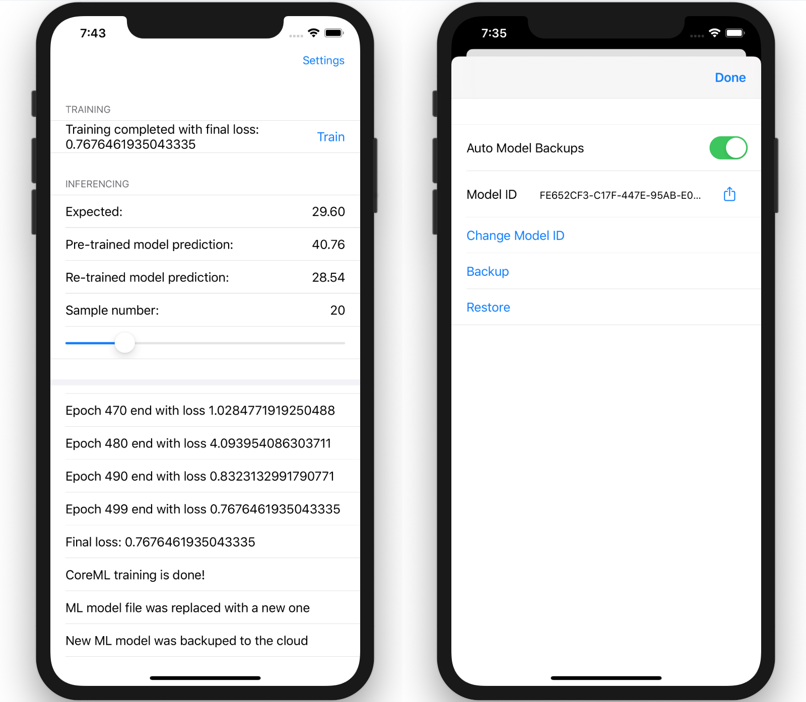

# distributed-model-training

This project aims to show an approach to implementing distributed training of a machine learning model on mobile devices.

`Swift for TensorFlow` is used for creating a pre-trained ML model on shared/proxy data. Then `Google Colab` and `protobuf` are used for recreating, making updatable and exporting the pre-trained model in `.mlmodel` format. The pre-trained model is delivered to the devices with new versions of the app. `Core ML 3` is used for on-device re-training on user data, so they do not leave the device; and also for inferencing. `Transfer learning` and `model personalization` concepts are used for this process as well.

The implementation process is structured so that only one `Swift` programming language is used at all stages of working with the model, making this approach even more convenient and reliable thanks to a single code base, i.e. reusing of pre-processing and featurization code in different parts of the distributed system.

This approach can be an alternative to `Federated Learning` because of its significant difficulties for production use at present, especially in combination with mobile devices.

