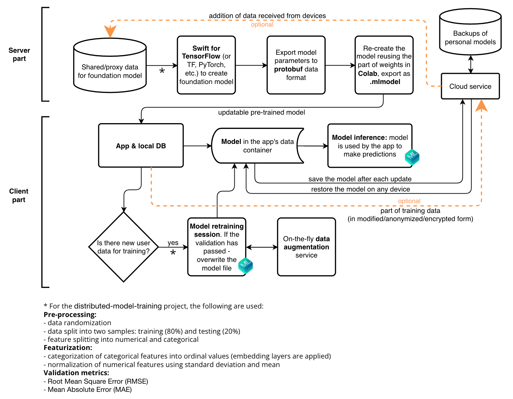

# distributed-model-training

This project aims to show an approach and mechanisms to implementing distributed training of a machine learning model - server/device training for iOS.

[`Swift for TensorFlow`](https://github.com/tensorflow/swift) is used for creating a pre-trained [foundation](https://en.wikipedia.org/wiki/Foundation_model) ML model on [shared/proxy data](https://github.com/denissimon/distributed-model-training/blob/master/1.%20macOS%20app/S4TF/housing.csv). This training takes place on a server or local Mac. Then `Google Colab` and `protobuf` are used for recreating (reusing the part of weights), making `updatable`, and exporting the pre-trained model in [`.mlmodel`](https://apple.github.io/coremltools/docs-guides/source/mlmodel.html) format. The updatable pre-trained model is delivered to devices with new versions of the app. [`Core ML`](https://developer.apple.com/documentation/coreml) is used for on-device retraining on user data, so they do not leave the device, ensuring a high level of privacy, and also for inference (making predictions). [`Transfer learning`](https://en.wikipedia.org/wiki/Transfer_learning), [`online learning`](https://en.wikipedia.org/wiki/Online_machine_learning) and [`model personalization`](https://developer.apple.com/documentation/coreml/model-personalization) concepts are used for this process as well.

The implementation process is structured so that only one `Swift` programming language is used at all stages of working with the model, making this approach even more convenient and reliable thanks to a single codebase, i.e. reusing of pre-processing, featurization and validation code in different parts of the distributed system. 

This approach can be an alternative to `Federated Learning` (FL) due to the significant difficulties in [production use](https://www.tensorflow.org/federated/faq) of FL currently, especially in combination with mobile devices.


In addition, backup and restoration of personal ML model (as a `.mlmodel` file) is implemented. This is particularly useful when the user reinstalls the app or changes the device.

***

Update: originally, `Swift for TensorFlow` was used (now in archived mode), but other tools such as `TensorFlow`, `PyTorch` or `Turi Create` can also be used instead. In this case, more testing will be required, since the pre-trained model will have to be written in `Python`, and code related to data processing during on-device retraining (pre-processing, featurization and validation code) will have to be written in `Swift`. The transformation of user data from the moment it is created to when it is sent to `Core ML` should be algorithmically exactly the same as in the `Python` code.

***

### Approach diagram

Schematically, this approach can be represented as follows:



### About the dataset and model

To demonstrate the work of the presented approach, a suitable dataset is used – [Boston House Prices](https://www.kaggle.com/datasets/vikrishnan/boston-house-prices) from the UCI Machine Learning Repository. Number of observations: 506. Number of features: 13 (including 11 numeric and 2 categorical (CHAS and RAD)); 14th column (MEDV) – price value.

On the server part, 2 pre-trained ML models are created:
- `s4tf_pre_trained_model.mlmodel` is non-updatable foundation model trained on common/proxy data
- `s4tf_updatable_model.mlmodel` is updatable, created from the first one using Transfer Learning, ready for further on-device retraining on user data.

To directly convert a foundation model to Core ML format, [`Core ML Tools`](https://apple.github.io/coremltools/docs-guides/) is used. The updatable model is supplied with the app.

Note that these 2 models and the dataset itself are supplied with the app for testing purposes. In production mode, only 1 updatable model should be supplied.

Neural network architecture:

```swift
struct RegressionModel: Module {
    var embedding1 = TensorFlow.Embedding<Float>(vocabularySize: 2, embeddingSize: 2)
    var embedding2 = TensorFlow.Embedding<Float>(vocabularySize: 9, embeddingSize: 5)
    var allInputConcatLayer = Dense<Float>(inputSize: (11 + 2 + 5), outputSize: 64, activation: relu)
    var hiddenLayer = Dense<Float>(inputSize: 64, outputSize: 32, activation: relu)
    var outputLayer = Dense<Float>(inputSize: 32, outputSize: 1)
    
    @differentiable
    func callAsFunction(_ input: MultiInputs<[Tensor<Float>], [Tensor<Int32>]>) -> Tensor<Float> {
        let embeddingOutput1 = embedding1(input.categorical[0])
        let embeddingOutput1Reshaped = embeddingOutput1.reshaped(to:
            TensorShape([embeddingOutput1.shape[0], embeddingOutput1.shape[2]]))
        let embeddingOutput2 = embedding2(input.categorical[1])
        let embeddingOutput2Reshaped = embeddingOutput2.reshaped(to:
            TensorShape([embeddingOutput2.shape[0], embeddingOutput2.shape[2]]))
        let allConcat = Tensor<Float>(concatenating: [input.numerical[0], embeddingOutput1Reshaped, embeddingOutput2Reshaped], alongAxis: 1)
        return allConcat.sequenced(through: allInputConcatLayer, hiddenLayer, outputLayer)
    }
}
```


The following parameters are used to train the foundation model: optimizer: RMSProp; epoch count: 500; batch size: 32; shuffle: true; learning rate: 0.001. After training, for each layer we get a set of parameters including weights that will then be used (in `protobuf` data structure format) in the next step in `Google Colab`.

### Optional sharing of training data

To speed up data collection for the foundation model and regularly improve its quality, it is optional and possible under certain conditions to use a `partial sharing` method (orange lines on the diagram above). One or several conditions may be used, including:

- user data are `modified` (originals are not sent from the device). For example, for text data - nouns/verbs are changed to synonyms from WordNet; for images - blur filters, color correction, etc. are applied; for audio - change of tonality, speed, as well as noise imposition, etc.
- user data are `anonymized` (using such [`data anonymization`](https://en.wikipedia.org/wiki/Data_anonymization) techniques as k-anonymity, [differential privacy](https://en.wikipedia.org/wiki/Differential_privacy), etc.) or `encrypted` before being sent to the server - in this case, data storage and model training on the server occurs in the same anonymized/encrypted form
- only a part of the user data are sent so that their overall high privacy is still maintained. The other part still never leaves the device in any form.

When an improved pre-trained model is received on the device again, the app replaces the user model with it, which is then first retrained and re-personalized on all or part of user data (unshared data only) stored in the local DB.

The advantages of this option is that it becomes possible to automate and speed up the collection of data for the foundation model, in order to improve it regularly, as well as users gain more knowledge from both initially common/proxy data and then shared data of all users of the app, which will improve subsequent predictions. At the same time, this still involves on-device retraining the user model on user data, and so user models are still personalized, which also improves the quality of predictions made for a particular user.

It is also worth noting the synergistic effect of such a quite novel approach in the field of ML and FL, when both global knowledge transfer and on-device knowledge transfer occur simultaneously, which ultimately is expressed in cross-device knowledge transfer.

### Additional notes 

* The newer [`.mlpackage`](https://apple.github.io/coremltools/docs-guides/source/comparing-ml-programs-and-neural-networks.html) format does not currently support on-device update, so `.mlmodel` should be used to make the model `updatable`. In the future, Apple may add this functionality to ML program model type.
* This project focuses on iOS development, but with some difference in the tools used (e.g. `Core ML` / `TensorFlow Lite` or `LiteRT`), it could be adopted for Android development as well.
